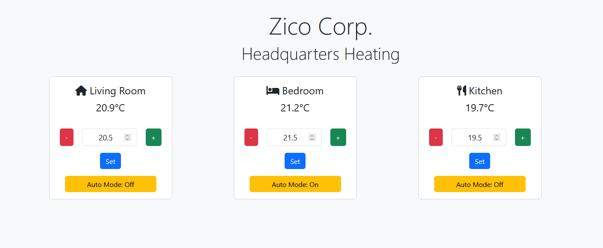

# Smart Thermostat Controller

This IoT project automates the control of a mechanical thermostat using multiple NodeMCU units, a servomotor, and temperature and infrared sensors. The system allows users to set and maintain a desired temperature range via HTTP requests managed by a central NodeMCU server, improving energy efficiency while modernizing an existing thermostat.

## Features

- **Automated Temperature Control:** Optimizes temperature regulation in an apartment using multiple NodeMCU units.
- **Precise Control:** Integrates a temperature sensor and infrared sensor with a servomotor for accurate thermostat adjustments.
- **Central Management:** Utilizes a central NodeMCU server to handle HTTP requests for seamless control and automatic temperature adjustments.

## Components Used

- **NodeMCU Units:** Microcontrollers for Wi-Fi connectivity.
- **Servomotor:** Controls the mechanical thermostat.
- **Temperature Sensor (DHT11):** Monitors ambient temperature.
- **Infrared Sensor:** Enhances automation capabilities.

## Usage

- **Move Servo Up:** Sends a request to move the thermostat up.
- **Move Servo Down:** Sends a request to move the thermostat down.
- **Set Temperature:** Allows users to set the desired temperature.
- **Auto Mode:** Activates or deactivates the automatic temperature adjustment feature.

## License

This project is licensed under the MIT License. 
## Acknowledgments

- [Adafruit](https://www.adafruit.com/) for the sensors and libraries used.
- [NodeMCU](https://nodemcu.readthedocs.io/en/release/) for the microcontroller platform.
